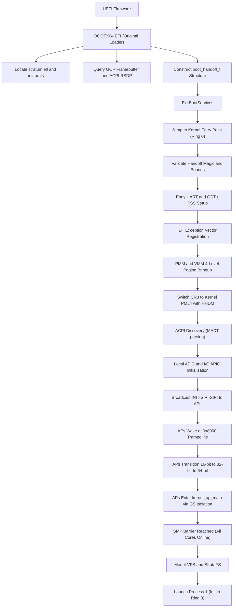

# Stratum Boot and SMP Bringup Flow

```mermaid
flowchart TD
    A["UEFI Firmware"] --> B["BOOTX64.EFI (Original Loader)"]
    B --> C["Locate stratum.elf and initramfs"]
    B --> D["Query GOP Framebuffer and ACPI RSDP"]
    B --> E["Construct boot_handoff_t Structure"]
    E --> F["ExitBootServices"]
    F --> G["Jump to Kernel Entry Point (Ring 0)"]
    G --> H["Validate Handoff Magic and Bounds"]
    H --> I["Early UART and GDT / TSS Setup"]
    I --> J["IDT Exception Vector Registration"]
    J --> K["PMM and VMM 4-Level Paging Bringup"]
    K --> L["Switch CR3 to Kernel PML4 with HHDM"]
    L --> M["ACPI Discovery (MADT parsing)"]
    M --> N["Local APIC and I/O APIC Initialization"]
    N --> O["Broadcast INIT-SIPI-SIPI to APs"]
    O --> P["APs Wake at 0x8000 Trampoline"]
    P --> Q["APs Transition 16-bit to 32-bit to 64-bit"]
    Q --> R["APs Enter kernel_ap_main via GS Isolation"]
    R --> S["SMP Barrier Reached (All Cores Online)"]
    S --> T["Mount VFS and StrataFS"]
    T --> U["Launch Process 1 (Init in Ring 3)"]
```
