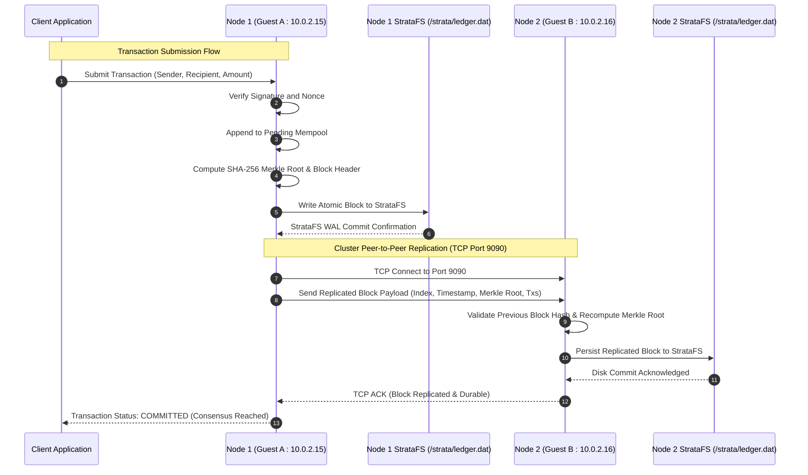

# Distributed Durable Ledger Replication Architecture

```mermaid
sequenceDiagram
    autonumber
    participant Client as Client Application
    participant Primary as Node 1 (Guest A : 10.0.2.15)
    participant Disk1 as Node 1 StrataFS (/strata/ledger.dat)
    participant Replica as Node 2 (Guest B : 10.0.2.16)
    participant Disk2 as Node 2 StrataFS (/strata/ledger.dat)

    Note over Client,Primary: Transaction Submission Flow
    Client->>Primary: Submit Transaction (Sender, Recipient, Amount)
    Primary->>Primary: Verify Signature and Nonce
    Primary->>Primary: Append to Pending Mempool
    Primary->>Primary: Compute SHA-256 Merkle Root & Block Header
    Primary->>Disk1: Write Atomic Block to StrataFS
    Disk1-->>Primary: StrataFS WAL Commit Confirmation

    Note over Primary,Replica: Cluster Peer-to-Peer Replication (TCP Port 9090)
    Primary->>Replica: TCP Connect to Port 9090
    Primary->>Replica: Send Replicated Block Payload (Index, Timestamp, Merkle Root, Txs)
    Replica->>Replica: Validate Previous Block Hash & Recompute Merkle Root
    Replica->>Disk2: Persist Replicated Block to StrataFS
    Disk2-->>Replica: Disk Commit Acknowledged
    Replica-->>Primary: TCP ACK (Block Replicated & Durable)
    Primary-->>Client: Transaction Status: COMMITTED (Consensus Reached)
```
