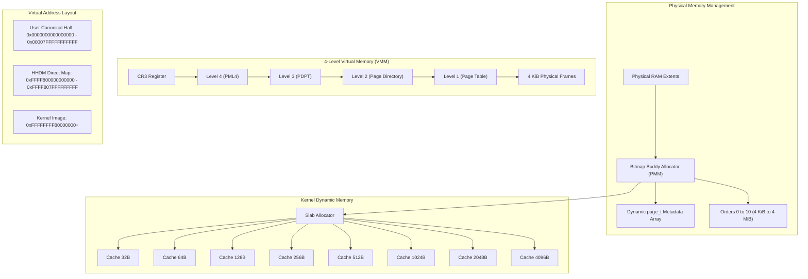

# Stratum Memory Architecture

```mermaid
flowchart TD
    subgraph PhysicalMemory["Physical Memory Management"]
        RAM["Physical RAM Extents"] --> PMM["Bitmap Buddy Allocator (PMM)"]
        PMM --> PageArray["Dynamic page_t Metadata Array"]
        PMM --> Orders["Orders 0 to 10 (4 KiB to 4 MiB)"]
    end

    subgraph KernelHeaps["Kernel Dynamic Memory"]
        PMM --> SLAB["Slab Allocator"]
        SLAB --> Cache32["Cache 32B"]
        SLAB --> Cache64["Cache 64B"]
        SLAB --> Cache128["Cache 128B"]
        SLAB --> Cache256["Cache 256B"]
        SLAB --> Cache512["Cache 512B"]
        SLAB --> Cache1K["Cache 1024B"]
        SLAB --> Cache2K["Cache 2048B"]
        SLAB --> Cache4K["Cache 4096B"]
    end

    subgraph VirtualMemory["4-Level Virtual Memory (VMM)"]
        CR3["CR3 Register"] --> PML4["Level 4 (PML4)"]
        PML4 --> PDPT["Level 3 (PDPT)"]
        PDPT --> PD["Level 2 (Page Directory)"]
        PD --> PT["Level 1 (Page Table)"]
        PT --> PhysicalFrames["4 KiB Physical Frames"]
    end

    subgraph AddressSpaces["Virtual Address Layout"]
        UserSpace["User Canonical Half: 0x0000000000000000 - 0x00007FFFFFFFFFFF"]
        HHDM["HHDM Direct Map: 0xFFFF800000000000 - 0xFFFF807FFFFFFFFF"]
        KernelText["Kernel Image: 0xFFFFFFFF80000000+"]
    end
```
