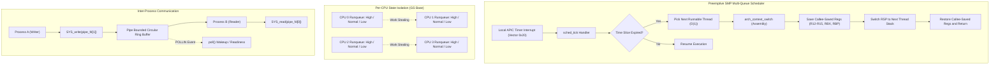

# Stratum Preemptive SMP Scheduler and IPC

```mermaid
flowchart TD
    subgraph SchedCore["Preemptive SMP Multi-Queue Scheduler"]
        Timer["Local APIC Timer Interrupt (Vector 0x20)"] --> SchedTick["sched_tick Handler"]
        SchedTick --> PreemptCheck{"Time Slice Expired?"}
        PreemptCheck -- "Yes" --> PickNext["Pick Next Runnable Thread (O(1))"]
        PreemptCheck -- "No" --> Ret["Resume Execution"]
        PickNext --> Switch["arch_context_switch (Assembly)"]
        Switch --> SaveRegs["Save Callee-Saved Regs (R12-R15, RBX, RBP)"]
        SaveRegs --> SwitchRSP["Switch RSP to Next Thread Stack"]
        SwitchRSP --> RestoreRegs["Restore Callee-Saved Regs and Return"]
    end

    subgraph PerCPURunqueues["Per-CPU State Isolation (GS Base)"]
        CPU0["CPU 0 Runqueue: High / Normal / Low"]
        CPU1["CPU 1 Runqueue: High / Normal / Low"]
        CPU2["CPU 2 Runqueue: High / Normal / Low"]
        CPU3["CPU 3 Runqueue: High / Normal / Low"]
        CPU0 -. "Work Stealing" .-> CPU1
        CPU2 -. "Work Stealing" .-> CPU3
    end

    subgraph IPCMechanisms["Inter-Process Communication"]
        Writer["Process A (Writer)"] --> SysWrite["SYS_write(pipe_fd[1])"]
        SysWrite --> PipeRing["Pipe Bounded Circular Ring Buffer"]
        PipeRing --> Reader["Process B (Reader)"]
        Reader --> SysRead["SYS_read(pipe_fd[0])"]
        PipeRing -. "POLLIN Event" .-> PollNotify["poll() Wakeup / Readiness"]
    end
```
