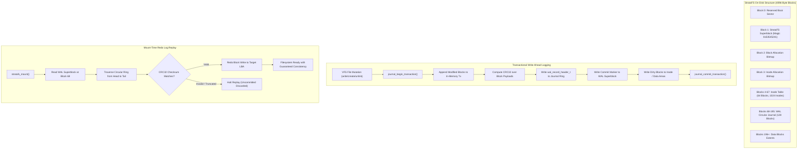

# StrataFS Storage and Write-Ahead Logging (WAL) Architecture

```mermaid
flowchart TD
    subgraph DiskLayout["StrataFS On-Disk Structure (4096-Byte Blocks)"]
        B0["Block 0: Reserved Boot Sector"]
        B1["Block 1: StrataFS Superblock (Magic 0x53545241)"]
        B2["Block 2: Block Allocation Bitmap"]
        B3["Block 3: Inode Allocation Bitmap"]
        B4["Blocks 4-67: Inode Table (64 Blocks, 1024 Inodes)"]
        B68["Blocks 68-195: WAL Circular Journal (128 Blocks)"]
        B196["Blocks 196+: Data Blocks Extents"]
    end

    subgraph WALFlow["Transactional Write-Ahead Logging"]
        Op["VFS File Mutation (write/create/unlink)"] --> TxStart["journal_begin_transaction()"]
        TxStart --> LogRecords["Append Modified Blocks to In-Memory Tx"]
        LogRecords --> Checksum["Compute CRC32 over Block Payloads"]
        Checksum --> FlushWAL["Write wal_record_header_t to Journal Ring"]
        FlushWAL --> CommitWAL["Write Commit Marker to WAL Superblock"]
        CommitWAL --> WriteTable["Write Dirty Blocks to Inode / Data Areas"]
        WriteTable --> TxDone["journal_commit_transaction()"]
    end

    subgraph CrashRecovery["Mount-Time Redo Log Replay"]
        Mount["stratafs_mount()"] --> ReadWAL["Read WAL Superblock at Block 68"]
        ReadWAL --> ScanEntries["Traverse Circular Ring from Head to Tail"]
        ScanEntries --> VerifyCRC{"CRC32 Checksum Matches?"}
        VerifyCRC -- "Valid" --> ReplayBlock["Redo Block Write to Target LBA"]
        VerifyCRC -- "Invalid / Truncated" --> StopReplay["Halt Replay (Uncommitted Discarded)"]
        ReplayBlock --> FinishMount["Filesystem Ready with Guaranteed Consistency"]
    end
```
